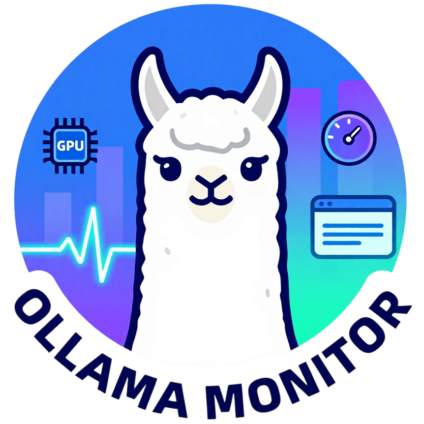
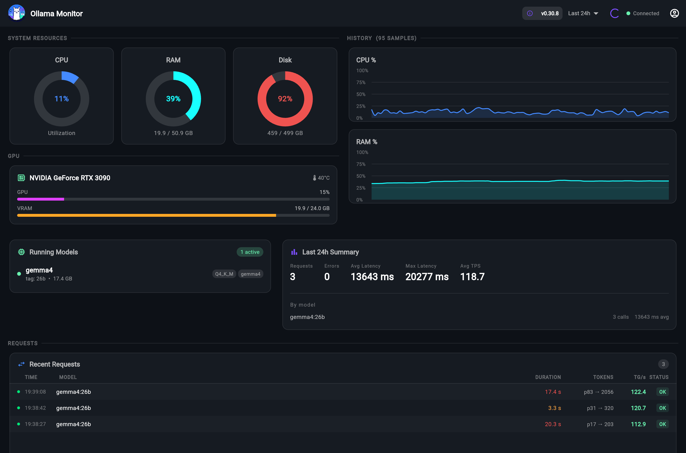
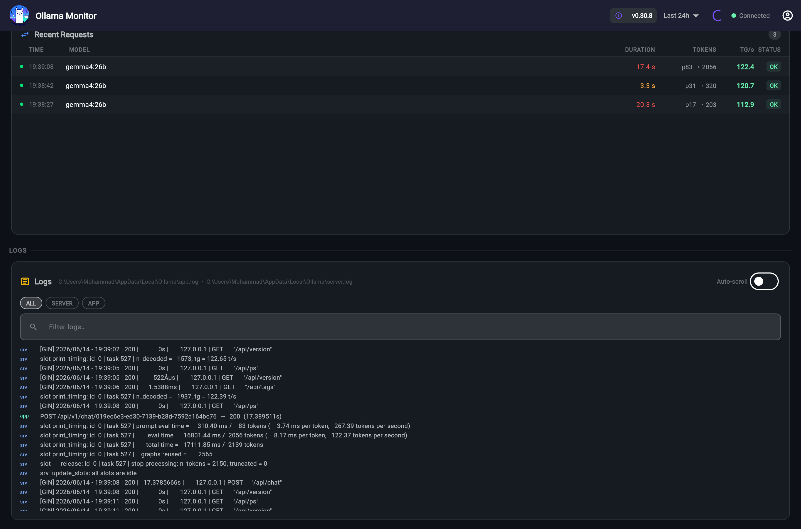
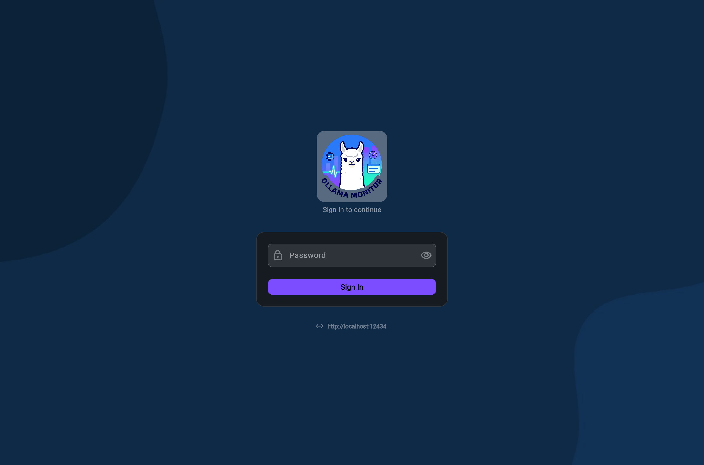

<p align="center">
  
</p>

<h1 align="center">Ollama Monitor</h1>

<p align="center">
  Real-time monitoring dashboard for <a href="https://ollama.com">Ollama</a> —<br>
  tracks running models, request metrics, system resources, GPU usage, and live logs.
</p>

<p align="center">
  <a href="LICENSE"></a>
  
  
  
</p>

---

## Screenshots

<p align="center">
  
</p>

<p align="center">
  
</p>

<p align="center">
  
</p>

---

## Features

- **Running model tracker** — loaded models, size, quantization, expiry
- **Request table** — per-request latency, tokens, tokens/sec, status badge, color-coded duration
- **System resources** — CPU, RAM, disk gauges with rolling history charts
- **GPU monitoring** — utilization, VRAM, temperature (NVIDIA & AMD)
- **Live log viewer** — filterable tail of Ollama logs (file or journald), `SERVER` / `APP` source badges
- **Multi-server dashboard** — connect to multiple Ollama backends simultaneously, switch servers from a dropdown
- **SQLite persistence** — 7-day history of metrics, requests, and important log events
- **WebSocket push** — dashboard updates every 2 seconds without browser polling
- **Password authentication** — single shared password protects each backend

## Architecture

### Single Ollama server

```
 Browser
   │
   │  HTTP + WebSocket
   ▼
┌─────────────────────┐
│  Flutter Dashboard  │  (served by nginx or any web host)
└─────────────────────┘
           │
           │  WebSocket + REST  (:12434)
           ▼
┌─────────────────────┐
│  FastAPI Backend    │──── Ollama API (localhost:11434)
│  (Ollama server)    │──── Log files / journald
└─────────────────────┘──── SQLite (monitor.db)
```

### Multiple Ollama servers

One backend runs on **each** Ollama machine. The frontend connects to all of them at once.

```
 Browser
   │
   ▼
┌─────────────────────┐
│  Flutter Dashboard  │  (one instance, anywhere)
└─────────────────────┘
    │           │           │
    ▼           ▼           ▼
┌────────┐ ┌────────┐ ┌────────┐
│Backend │ │Backend │ │Backend │   each on its own Ollama server
│:12434  │ │:12434  │ │:12434  │   each talks to local Ollama :11434
└────────┘ └────────┘ └────────┘
```

The server selector dropdown appears in the top bar automatically when more than one backend is configured.

## Installation

### Prerequisites

- **Backend** — Python 3.10+, or Docker
- **Frontend** — any web server (nginx, Apache, GitHub Pages …), or Docker
- **Ollama** — already installed and running on the target machine(s)

## Single Ollama Server

### Option 1 — Install from source as a background service

#### Linux (systemd)

```bash
git clone https://github.com/Jamalianpour/ollama-monitor.git
cd ollama-monitor
sudo bash service/install-linux.sh
```

The script:
- Creates a dedicated `ollama-monitor` system user
- Installs the backend to `/opt/ollama-monitor`
- Creates a Python virtual environment and installs dependencies
- Registers and starts a systemd service (`ollama-monitor`) that survives reboots

```bash
# Check status
systemctl status ollama-monitor

# Follow live logs
journalctl -u ollama-monitor -f

# Uninstall
sudo bash service/uninstall-linux.sh
```

#### Windows (NSSM)

Open PowerShell as Administrator:

```powershell
git clone https://github.com/Jamalianpour/ollama-monitor.git
cd ollama-monitor
.\service\install-windows.ps1
```

The script installs [NSSM](https://nssm.cc) (via winget if available) and registers a Windows Service that starts at boot. Logs are written to `C:\OllamaMonitor\logs\`.

```powershell
# Uninstall
.\service\uninstall-windows.ps1
```

**Serve the dashboard**

Download the pre-built Flutter web release (see [Option 3](#option-3--download-pre-built-release)) and serve it with any web server, or run:

```bash
cd ollama_monitor_app
flutter build web --release
python3 -m http.server 8080 --directory build/web
```

Open `http://localhost:8080`, enter the backend URL (`http://localhost:12434`), and set your password.

### Option 2 — Docker

The included `docker-compose.yml` starts both backend and frontend with a single command.

**1. Configure Ollama log paths**

Find where Ollama writes its logs:

| OS | Log location |
|---|---|
| Linux — systemd | journald (no file needed, backend reads it automatically) |
| Linux — manual | `~/.ollama/logs/` or `/var/log/ollama/` |
| macOS | `~/.ollama/logs/` |
| Windows | `C:\Users\<you>\AppData\Local\Ollama\` |

**2. Edit `docker-compose.yml`** — uncomment the log volume mount that matches your OS and adjust the path.

**3. Create a `.env` file** next to `docker-compose.yml`:

```env
OLLAMA_HOST=http://host.docker.internal:11434
OLLAMA_SERVER_LOG=/ollama_logs/server.log
OLLAMA_APP_LOG=/ollama_logs/app.log
```

> On Linux, replace `host.docker.internal` with your host IP, or add `--add-host=host.docker.internal:host-gateway` to the backend service.

**4. Start everything**

```bash
docker compose up -d
```

| Service | URL |
|---|---|
| Dashboard | `http://localhost` |
| Backend API | `http://localhost:12434` |

### Option 3 — Download pre-built release

1. Go to the [Releases page](https://github.com/Jamalianpour/ollama-monitor/releases)
2. Download `ollama-monitor-web-vX.Y.Z.zip`
3. Extract and serve with any static web server:

```bash
unzip ollama-monitor-web-vX.Y.Z.zip -d /var/www/html/ollama-monitor
```

Or with nginx — add to your site config:

```nginx
location /ollama-monitor/ {
    root /var/www/html;
    try_files $uri $uri/ /ollama-monitor/index.html;
}
```

The backend still needs to run on the Ollama machine (Option 1 or Option 2 above, backend only).

## Multiple Ollama Servers

### Step 1 — Deploy the backend on each Ollama server

Pick **Option 1 (service)** or **Option 2 (Docker)** above, but run only the backend on each machine.

**Docker — backend only:**

```bash
# On each Ollama server
git clone https://github.com/Jamalianpour/ollama-monitor.git /opt/ollama-monitor
cd /opt/ollama-monitor

# Create .env for this server
cat > .env << EOF
OLLAMA_HOST=http://localhost:11434
OLLAMA_SERVER_LOG=/ollama_logs/server.log
OLLAMA_APP_LOG=/ollama_logs/app.log
EOF

docker compose up -d backend
```

Verify:

```bash
curl http://localhost:12434/api/auth/status
# → {"password_set": false}
```

**Firewall:** open TCP port `12434` inbound on each Ollama server so the browser can reach it.

### Step 2 — Deploy the frontend once

Deploy the dashboard on any machine (or use a CDN) — it is a static web app.

**Docker:**
```bash
docker compose up -d frontend
```

**Pre-built release:** Download `ollama-monitor-web-vX.Y.Z.zip` from [Releases](https://github.com/Jamalianpour/ollama-monitor/releases) and serve the extracted files (see Option 3 above).

### Step 3 — Connect all servers from the browser

1. Open the dashboard URL
2. Enter the first backend URL (e.g. `http://192.168.1.10:12434`) and click **Connect**
3. Set a password on the first server
4. Open **Account → Manage Servers → Add Server** for each additional backend:
   - **Name:** `GPU Server 2`
   - **URL:** `http://192.168.1.11:12434`
   - **Password:** *(same password)*
5. Use the server dropdown in the top bar to switch between servers

> All backends should use the same password. On login, the dashboard authenticates against all configured backends at once.

## Environment variables

| Variable | Default | Description |
|---|---|---|
| `OLLAMA_HOST` | `http://localhost:11434` | Ollama API base URL |
| `OLLAMA_SERVER_LOG` | *(auto-detect)* | Path to Ollama `server.log` |
| `OLLAMA_APP_LOG` | *(auto-detect)* | Path to Ollama `app.log` |
| `MONITOR_DB` | `monitor.db` | SQLite database path |
| `POLL_INTERVAL` | `2` | Seconds between metric polls |
| `LOG_KEEP_DAYS` | `7` | Days of history retained in DB |

If neither `OLLAMA_SERVER_LOG` nor `OLLAMA_APP_LOG` is set:
- **Linux** — the backend reads from `journald` automatically (no configuration needed)
- **Other OS** — a warning appears in the log panel

## REST API

All endpoints require `Authorization: Bearer <token>` except `/api/auth/*`.

| Method | Path | Description |
|---|---|---|
| `POST` | `/api/auth/setup` | Set password (first run only) |
| `POST` | `/api/auth/login` | Login — returns a session token |
| `POST` | `/api/auth/logout` | Invalidate token |
| `POST` | `/api/auth/change-password` | Change password |
| `GET` | `/api/auth/status` | Check if password is set |
| `GET` | `/api/health` | Backend status, log paths, DB path |
| `GET` | `/api/system` | Current CPU / RAM / GPU snapshot |
| `GET` | `/api/ps` | Ollama running models (proxy) |
| `GET` | `/api/models` | Ollama model list (proxy) |
| `GET` | `/api/version` | Ollama version (proxy) |
| `GET` | `/api/logs` | Recent in-memory log lines |
| `GET` | `/api/requests` | Recent in-memory request records |
| `GET` | `/api/history/metrics?hours=24` | Metric history from DB |
| `GET` | `/api/history/requests?hours=24` | Request history from DB |
| `WS` | `/ws?token=<token>` | Live push — metrics, logs, requests |

---

## Contributing

See [CONTRIBUTING.md](CONTRIBUTING.md). Bug reports, feature requests, and pull requests are all welcome.

## License

MIT — see [LICENSE](LICENSE).
